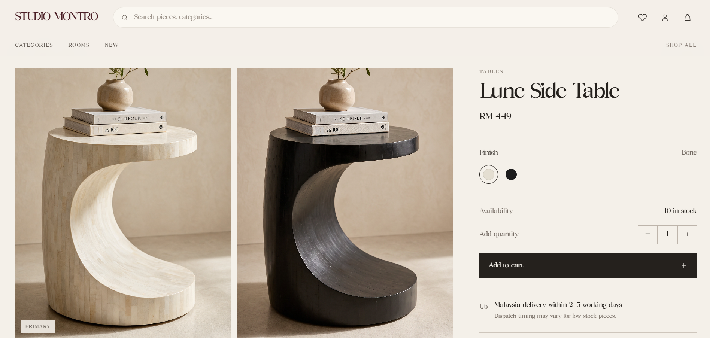
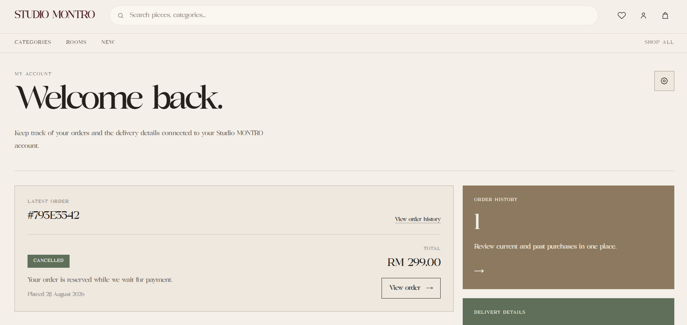
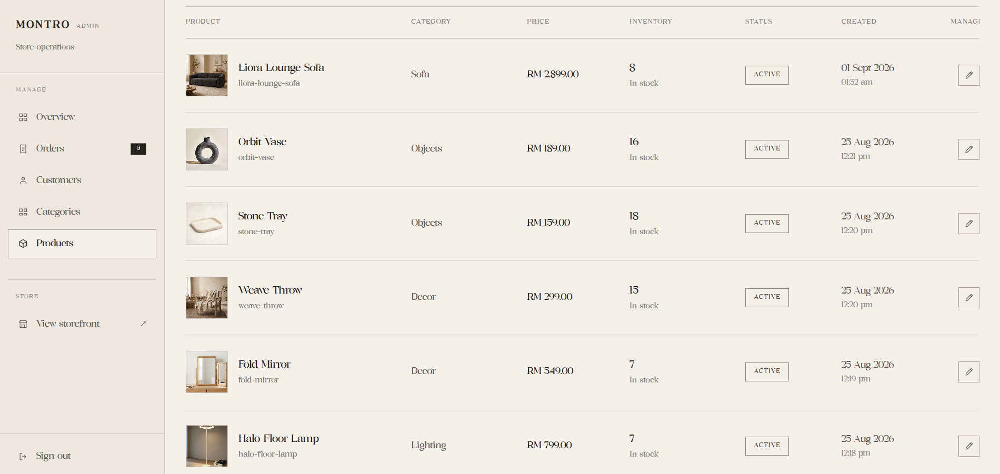
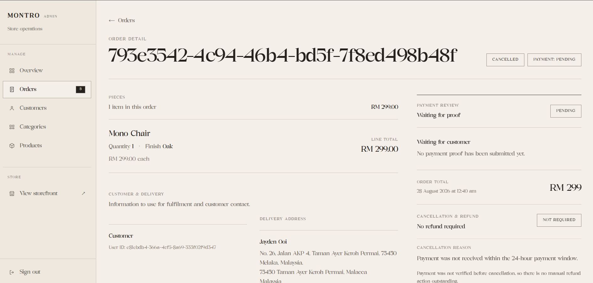

# Studio MONTRO

**A production-deployed full-stack furniture commerce platform — designed and built end-to-end.**

[Live Storefront](https://studio-montro.vercel.app/) · Next.js · React · TypeScript · FastAPI · Supabase · PostgreSQL · Vercel · Railway

---

> **I built Studio MONTRO to answer a bigger question than “can I make an ecommerce UI?”**
>
> I wanted to understand what it takes to turn a polished storefront into an actual commerce system: authentication, customer data, cart state, checkout, inventory, payment-proof handling, admin operations, authorization, storage, database security and production deployment.


Studio MONTRO combines an editorial furniture storefront with the operational side of ecommerce. Customers can browse, save, purchase and manage orders, while administrators can manage products, inventory, images, customers and order/payment workflows from a separate protected admin experience.

This project was built as a **portfolio-grade full-stack application**, not a live commercial retailer.

---

## What makes this project different

Many ecommerce portfolio projects stop after a product grid, cart and simulated checkout.

Studio MONTRO goes further by implementing both sides of the system:

| Customer experience | Store operations |
| --- | --- |
| Product discovery and categories | Product management |
| Product galleries and finishes | Category management |
| Authentication and account flows | Inventory management |
| Saved products | Product image management |
| Cart and quantity management | Customer records |
| Checkout | Order operations |
| Payment-proof submission | Payment-proof review |
| Order history | Protected admin workflows |
| Address management | Storefront visibility controls |

The most important part of the project is not the number of screens. It is how those screens connect through the **same authentication, API, database and order lifecycle**.

---

## Product experience



The product experience supports:

- active product/category data
- multiple product images
- multiple finishes / colours
- stock availability
- quantity controls
- saved-product state
- authenticated cart operations
- responsive product-detail layouts
- related product recommendations

The visual direction was intentionally restrained: warm neutral surfaces, editorial typography, large imagery and minimal interaction patterns rather than a generic dashboard/ecommerce template.

---

## Customer account



Authenticated customers can manage their relationship with the store beyond checkout:

- account information
- delivery addresses
- order history
- order detail
- payment-proof submission
- saved products
- password recovery and reset

This forced me to think about **ownership and authorization**, not just whether a user was logged in.

A valid session should not automatically mean a customer can read or modify another customer's data.

---

## Admin operations



The admin area is a major part of Studio MONTRO.

It is not a visual mockup. It operates on the same product, inventory, customer and order data used by the storefront.

Administrators can manage:

- products
- product status / storefront visibility
- categories
- inventory
- finishes / colours
- product images and ordering
- customers
- orders
- payment-proof review

### Order operations



The order view brings together product lines, customer information, delivery data, payment state and cancellation/refund context so the admin side behaves more like an operational tool than a static portfolio screen.

---

# System architecture

```text
                           Customer / Admin
                                  │
                                  ▼
                      Next.js Frontend
                           Vercel
                                  │
                 ┌────────────────┴────────────────┐
                 │                                 │
                 ▼                                 ▼
          Supabase Auth                     FastAPI API
                                               Railway
                                                  │
                                                  ▼
                                         Supabase Platform
                                      ┌───────────┼───────────┐
                                      │           │           │
                                      ▼           ▼           ▼
                                  PostgreSQL    Storage    RLS / RPC
```

### Why this architecture?

I deliberately kept the frontend, API and data infrastructure as separate concerns.

- **Vercel** hosts the Next.js frontend.
- **Railway** runs the FastAPI backend.
- **Supabase** provides PostgreSQL, authentication and object storage.
- **GitHub** is the source-control and deployment trigger.

That separation introduced real production concerns such as environment configuration, CORS, bearer-token validation and cross-service debugging — all things that disappear in a localhost-only demo.

---

# Tech stack

### Frontend

- **Next.js 16**
- **React 19**
- **TypeScript**
- **Tailwind CSS 4**
- **Supabase JavaScript client**

### Backend

- **Python**
- **FastAPI**
- **Uvicorn**

### Data & infrastructure

- **PostgreSQL**
- **Supabase Auth**
- **Supabase Storage**
- **Supabase Row Level Security**
- **SQL migrations / RPC**
- **Vercel**
- **Railway**
- **GitHub**

---

# Engineering highlights

## Authentication is not authorization

Supabase Auth establishes who the user is.

Protected FastAPI requests send the user's bearer token to the backend, where the current user is resolved before protected operations continue.

Administrative privileges are checked separately.

```text
Logged in
   ≠
Allowed to perform admin operations
```

This distinction influenced both the backend API and database policies.

---

## End-to-end commerce state

The project models a real workflow instead of ending at a fake success screen.

```text
Browse
  ↓
Select product / finish
  ↓
Cart
  ↓
Checkout
  ↓
Order created
  ↓
Payment proof
  ↓
Admin review
  ↓
Order processing / cancellation
```

Cart, product selection, customer identity, order data and payment state all have to remain consistent across frontend, API and database layers.

---

## Product and inventory operations

A product is more than a name and price.

Studio MONTRO supports data such as:

- category
- slug
- active / inactive status
- price
- stock quantity
- description
- material
- dimensions
- finishes / colours
- multiple images
- image ordering

The storefront derives navigation and product visibility from active commerce data rather than relying only on hardcoded links.

---

## Storage and payment proofs

Product images and customer payment proofs have different trust requirements.

The project therefore treats public storefront media and payment evidence as different storage concerns, with database/storage policy hardening applied to sensitive payment-proof access.

---

## Database security

Security-sensitive database changes are versioned as migrations under:

```text
supabase/migrations/
```

The repository includes work around:

- restricting customer/admin privilege changes
- hardening admin checks
- tightening payment-proof storage policies
- hardening database function search paths
- removing legacy order-expiry behaviour

I wanted the security model to be visible in the repository rather than existing only as undocumented dashboard configuration.

---

# Repository structure

```text
studio-montro/
├── backend/
│   ├── auth.py
│   ├── database.py
│   ├── main.py
│   └── run_e2e_test.ps1
│
├── frontend/
│   ├── src/
│   │   ├── app/
│   │   ├── components/
│   │   ├── hooks/
│   │   └── lib/
│   ├── public/
│   └── package.json
│
├── database/
├── supabase/
│   └── migrations/
│
├── railway.json
├── requirements.txt
└── README.md
```

Representative application areas include:

```text
/
├── products
├── cart
├── checkout
├── saved
├── account
├── login
├── auth
├── forgot-password
├── reset-password
├── order-success
└── admin
```

---

# Deployment

## Frontend — Vercel

The Next.js application is deployed on Vercel and connected to the production Git branch.

A production push triggers a new frontend build and deployment.

## Backend — Railway

The FastAPI service is deployed independently on Railway and runs with Uvicorn.

## Database / Auth / Storage — Supabase

Supabase provides:

- PostgreSQL database
- authentication
- object storage
- Row Level Security
- database functions / RPC
- migrations

---

# Local development

## Frontend

```bash
cd frontend
npm install
npm run dev
```

Create `frontend/.env.local`:

```env
NEXT_PUBLIC_API_URL=
NEXT_PUBLIC_SUPABASE_URL=
NEXT_PUBLIC_SUPABASE_ANON_KEY=
NEXT_PUBLIC_STUDIO_WHATSAPP_NUMBER=
```

## Backend

From the repository root:

```bash
pip install -r requirements.txt
uvicorn main:app --app-dir backend --reload
```

Backend environment variables:

```env
SUPABASE_URL=
SUPABASE_KEY=
FRONTEND_ORIGINS=
```

Production secrets should never be committed to the repository.

---

# Development checks

The frontend includes:

```bash
npm run lint
npm run typecheck
npm run build
```

These checks are used to catch linting, TypeScript and production-build issues before deployment.

---

# What I learned

Studio MONTRO changed how I think about full-stack development.

The difficult parts were rarely isolated components. They were the boundaries between systems:

- keeping frontend and backend API contracts aligned
- distinguishing authentication from authorization
- making customer ownership rules explicit
- keeping inventory and order state consistent
- handling file storage safely
- moving from local development to production URLs
- configuring CORS and environment variables correctly
- debugging behaviour that only appeared after deployment
- designing admin tools around operational tasks rather than only visual polish

The project evolved through repeated local testing, production testing, debugging and security hardening.

That process is the part of Studio MONTRO I value most.

---

# Current scope

Studio MONTRO is intentionally presented as a **portfolio implementation**, not a live retailer.

A commercial rollout would typically add:

- integrated payment gateway
- transactional email automation
- monitoring and error tracking
- analytics
- staging infrastructure
- broader automated test coverage
- full accessibility audit
- expanded operational tooling

I prefer to make that boundary explicit rather than claim portfolio infrastructure is equivalent to a production retail business.

---

# What this project demonstrates

Studio MONTRO is evidence that I can take a product beyond a visual concept and work across the full application lifecycle:

**Product thinking → UI → frontend state → API → authentication → authorization → database → storage → deployment → production debugging**

My role covered:

- UI and responsive implementation
- frontend application development
- FastAPI API development
- Supabase integration
- authentication and authorization
- database/security work
- admin operations
- deployment configuration
- production debugging

---

## Live demo

**https://studio-montro.vercel.app/**

If you are reviewing this project as part of a hiring process, I recommend looking at both the **customer storefront** and the **admin workflow** — the relationship between the two is the core of the project.
